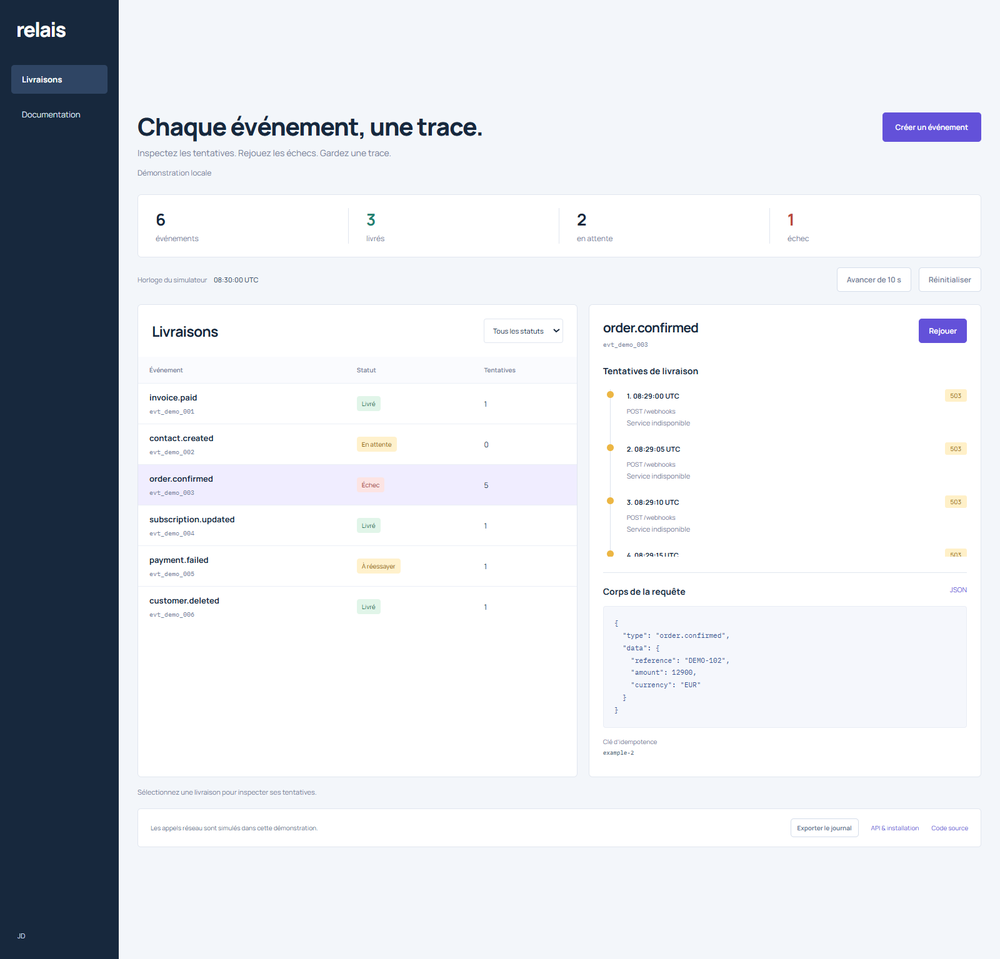
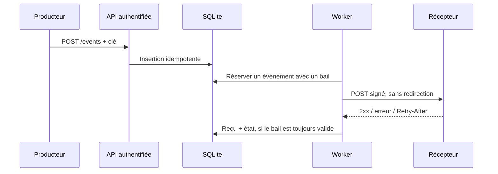

# Relais

### Chaque événement, une trace.

Un service de livraison de webhooks avec une file SQLite persistante, des tentatives signées et un historique inspectable. Une interface de démonstration permet de manipuler les scénarios sans configurer de serveur.

[**Essayer la démonstration**](https://imtoocompedidiv.github.io/relais/) · [API](#api) · [Garanties et limites](#garanties-et-limites)



## Deux surfaces utilisables

**Démonstration React/TypeScript** : créer un événement, choisir une séquence de réponses, avancer l’horloge, inspecter les tentatives, rejouer un échec et exporter le journal. Les appels sont simulés ; aucun serveur de livraison public n’est exposé.

**Service Node.js/SQLite** : API HTTP authentifiée et worker de livraison effectuant de vrais POST vers une destination définie par l’administrateur. Le test d’intégration démarre un récepteur HTTP local et vérifie la signature et le reçu.

## Mécanismes

- Clé d’idempotence unique : une requête identique retrouve le même événement ; une clé réutilisée avec un contenu différent reçoit HTTP 409.
- Transactions `BEGIN IMMEDIATE`, journal WAL et baux de traitement. Après expiration d’un bail, un autre worker peut reprendre ; un reçu provenant de l’ancien bail est refusé.
- Historique durable de chaque tentative, y compris les baux expirés ; rejeu manuel sans effacer les reçus précédents.
- Backoff exponentiel avec jitter, prise en compte de `Retry-After`, cinq tentatives par cycle, puis classement en échec.
- Signature HMAC-SHA256 liée à l’identifiant, l’horodatage et au corps exact. Fonction de vérification avec fenêtre de cinq minutes.
- Délai réseau de dix secondes, redirections non suivies, payload borné, erreurs 4xx permanentes sauf 408/425/429.

## Architecture



## Démarrer

Node.js **22.13+**. `node:sqlite` est encore signalé expérimental par Node 22. Le serveur utilise exclusivement des modules natifs de Node ; les dépendances npm servent à l’interface.

```sh
npm ci
npm run dev        # démonstration locale
npm run check     # TypeScript, tests du simulateur et du serveur
npm run build
```

Pour le service, définir les variables dans l’environnement du processus :

| Variable             | Valeur                                                                         |
| -------------------- | ------------------------------------------------------------------------------ |
| `RELAIS_TOKEN`       | Secret aléatoire d’au moins 32 caractères, pour authentifier les producteurs   |
| `RELAIS_SECRET`      | Autre secret aléatoire d’au moins 32 caractères, partagé avec le récepteur     |
| `RELAIS_TARGET`      | URL HTTPS de votre récepteur                                                   |
| `RELAIS_DB`          | Chemin SQLite, `relais.db` par défaut                                          |
| `RELAIS_HOST`        | `127.0.0.1` par défaut                                                         |
| `PORT`               | `4310` par défaut                                                              |
| `RELAIS_ALLOW_LOCAL` | `1` autorise HTTP uniquement sur une adresse de boucle locale, pour les essais |

Générer chaque secret avec `node -e "console.log(require('node:crypto').randomBytes(32).toString('hex'))"`, puis lancer `npm run server`. Aucun fichier `.env` n’est chargé implicitement.

## API

Toutes les routes `/events` exigent `Authorization: Bearer <RELAIS_TOKEN>`. `GET /health` indique seulement si le processus répond.

| Route                    | Résultat                                                    |
| ------------------------ | ----------------------------------------------------------- |
| `POST /events`           | 201 créé ; 200 déjà reçu ; 409 contenu conflictuel          |
| `GET /events`            | Les 100 événements les plus récents                         |
| `GET /events/:id`        | Événement et historique                                     |
| `POST /events/:id/retry` | Remettre un échec en file ; 409 si l’état ne l’autorise pas |

Corps d’une création :

```json
{
  "key": "facture-2026-42",
  "type": "invoice.paid",
  "data": { "reference": "FAC-42", "amount": 89000, "currency": "EUR" }
}
```

Le récepteur reçoit `{ "type": ..., "data": ... }` et les en-têtes `x-relais-id`, `x-relais-timestamp`, `x-relais-signature`. Le message signé est `id.timestamp.corpsJSONexact`. Voir [`verifySignature`](server/delivery.mjs). L’idempotence d’entrée compare le JSON sérialisé : conserver l’ordre des propriétés lors d’un rejeu.

## Garanties et limites

La livraison est **au moins une fois**, pas exactement une fois : une réponse perdue ou un bail expiré peut produire un second appel. Le récepteur doit dédupliquer avec `x-relais-id` ; la signature ne remplace pas ce contrôle. Les journaux ne constituent pas une preuve externe d’intégrité.

Le service cible une seule destination de confiance définie au lancement. Il n’accepte aucune URL de livraison dans l’API. Il n’inclut pas de gestion multi-tenant, d’authentification par utilisateur, de rotation automatique des secrets ou de rétention automatique des événements. Avant une exposition Internet, il faut notamment un proxy TLS, des quotas et une politique de sauvegarde. La démo publique n’est pas connectée au service.

## Vérifications

4 tests du simulateur et 8 tests serveur couvrent l’idempotence, la concurrence entre connexions SQLite, la persistance sur disque, les anciens baux, les délais de reprise, les signatures, l’API et une livraison HTTP réelle sur boucle locale. Aucune performance de production n’est revendiquée.

## Crédits

Projet de JD. React, Vite, TypeScript et Vitest pour l’interface ; Node.js et SQLite pour le service ; Manrope et IBM Plex Mono via Fontsource. Données de démonstration fictives. Code du projet sous licence MIT.
